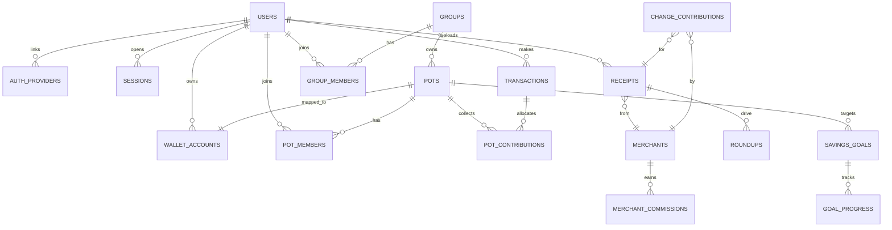
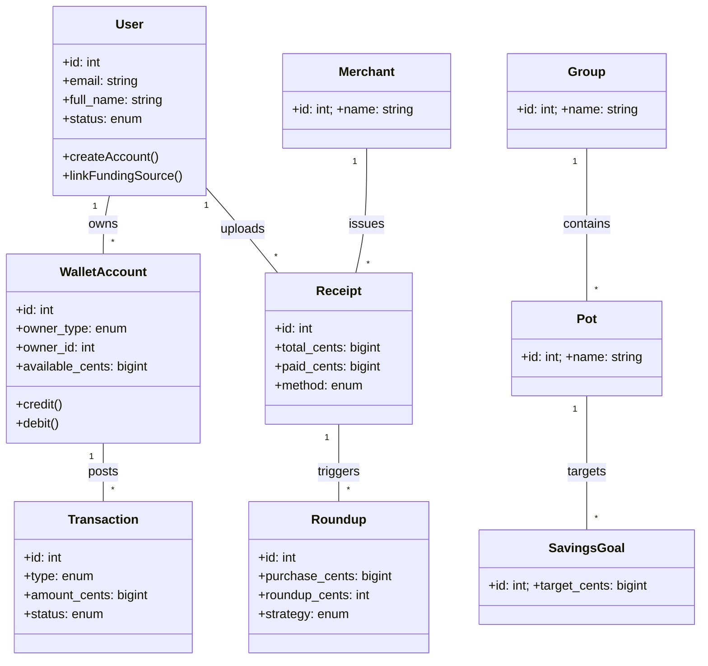
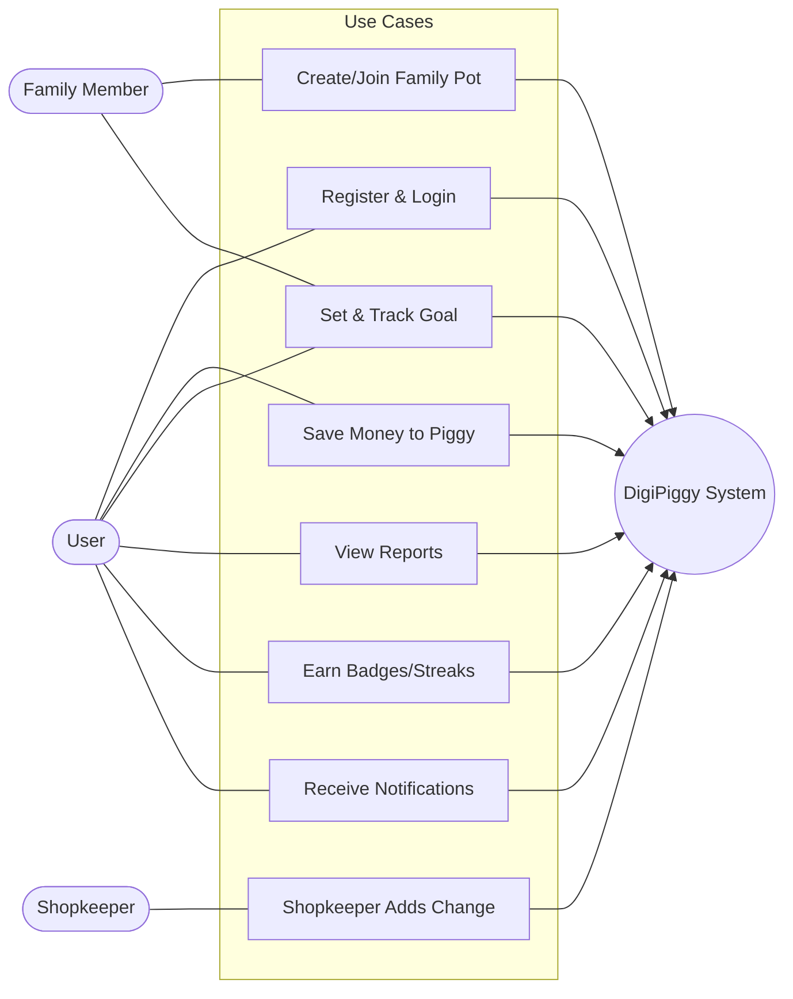

# DigiPiggy — Database Design (Phase 2)

**Team:** Devendra Namani, Jagadishwar Reddy, Ahmed Azzam

This file satisfies the Phase‑2 requirements: feature→data mapping, entities & attributes (with PK/FK/constraints), ER diagram, SQL schema (DDL), UML diagram, and a short explanation of how the schema supports the features.

---

## 1) Features → Data Mapping (aligned to Part‑1 EPICs)

1. **User Registration & Secure Login** – `users`, `auth_providers`, `sessions`, optional `kyc_profiles`, `audit_logs`  
2. **Digital Piggy Bank (Manual Saves)** – `wallet_accounts`, `transactions`, optional `pot_contributions`  
3. **Family & Group Saving Accounts** – `groups`, `group_members`, `pots`, `pot_members`, `wallet_accounts`  
4. **Goal Tracking** – `savings_goals`, `goal_progress`, `pots`, `pot_contributions`  
5. **Gamification & Rewards** – `badges`, `user_badges`, `streaks` (optional), `events` (optional)  
6. **Reports & Analytics** – `transactions`, `pot_contributions`, `goal_progress`  
7. **Shopkeeper/Partner Integration (5% commission)** – `merchants`, `receipts`, `change_contributions`, `merchant_commissions`, `transactions`, `revenue_shares`  
8. **Multi‑platform Access & Notifications** – `notification_settings`, `notifications` (+ APIs for all above)

> *Future scope:* basic investing via `investment_accounts`, `orders`, `portfolio_positions`, `prices` (can be off for MVP).

---

## 2) Entities & Attributes (MVP)

> The SQL in `sql/01_schema.sql` is the source of truth. Below is a readable summary.

### users
- **PK:** id  
- **Attributes:** email (UNIQUE, NOT NULL), phone (UNIQUE), password_hash (NOT NULL), full_name (NOT NULL), dob, status, created_at, updated_at

### auth_providers
- **FK:** user_id → users.id  
- **Attributes:** provider, provider_uid (UNIQUE), created_at

### sessions
- **FK:** user_id → users.id  
- **Attributes:** jwt_id (UNIQUE), ip, user_agent, created_at, expires_at, revoked_at

### wallet_accounts
- **PK:** id  
- **Attributes:** owner_type ('user'|'pot'), owner_id, currency, available_cents, created_at

### transactions
- **FKs:** user_id → users.id, wallet_account_id → wallet_accounts.id  
- **Attributes:** type, amount_cents, currency, status, memo, external_ref (UNIQUE), created_at

### groups & group_members
- **groups:** owner_user_id → users.id  
- **group_members:** (group_id,user_id) UNIQUE; role in ('owner','admin','member')

### pots & pot_members
- **pots:** group_id → groups.id, wallet_account_id → wallet_accounts.id (UNIQUE)  
- **pot_members:** (pot_id,user_id) UNIQUE; role in ('owner','contributor','viewer')

### pot_contributions
- **FKs:** pot_id → pots.id, transaction_id → transactions.id  
- **Attributes:** amount_cents, created_at

### savings_goals & goal_progress
- **savings_goals:** pot_id → pots.id; target_cents, target_date, name  
- **goal_progress:** goal_id → savings_goals.id; (goal_id, snapshot_at) UNIQUE; balance_cents

### merchants, receipts, roundups
- **receipts:** user_id → users.id, merchant_id → merchants.id; total_cents, paid_cents, method, purchased_at, source  
- **roundups:** user_id → users.id, receipt_id → receipts.id; roundup_cents (0–99), strategy

### change_contributions & merchant_commissions
- **change_contributions:** user_id (nullable) → users.id, merchant_id → merchants.id, receipt_id → receipts.id; amount_cents  
- **merchant_commissions:** merchant_id → merchants.id, contribution_id → change_contributions.id; commission_rate_bps (default 500), commission_cents

### notifications & notification_settings
- **notification_settings:** user_id → users.id; booleans for email/sms/push, quiet_hours_json  
- **notifications:** user_id → users.id; channel, title, body, sent_at, read_at

### audit_logs
- **Attributes:** actor_user_id → users.id (nullable), action, target_type, target_id, ip, user_agent, created_at

> *Optional future:* `investment_accounts`, `orders`, `portfolio_positions`, `prices`, `revenue_shares` are included in the SQL.

---

## 3) ER Diagram (Mermaid for GitHub)

> 

---

## 4) Database Schema (DDL)

See `sql/01_schema.sql` (included in this repo). You can also copy a snippet into this doc if required.

---

## 5) UML Diagrams

### 5.1 Class Diagram (Mermaid)

### 5.2 Use Case Diagram (Mermaid)

---

## 6) How the Schema Supports Features

- **Registration & Login**: `users`, `auth_providers`, `sessions`, `audit_logs`  
- **Manual saves**: `transactions` credit `wallet_accounts`; optional `pot_contributions` to a pot  
- **Family/group**: `groups`, `group_members`, `pots`, `pot_members` + `wallet_accounts` per pot  
- **Goals & progress**: `savings_goals` with `goal_progress` snapshots  
- **Gamification**: `badges`, `user_badges` (streaks/events optional)  
- **Reports**: aggregate `transactions`/`pot_contributions` by month and pot  
- **Shopkeeper change**: `change_contributions` → `merchant_commissions` (5% default) → funds via `transactions`  
- **Notifications**: `notification_settings` + `notifications`

---

## 7) Reproduce / Demo

1. Open **MySQL Workbench** → open `sql/01_schema.sql` → press ⚡ (execute).  
2. Refresh **Schemas** (left panel) → expand `digipiggy` → confirm tables created.  
3. ER diagram (image requirement):  
   - Workbench menu: **Database → Reverse Engineer…** → pick `digipiggy` → Next → Next → Finish.  
   - Then menu: **Model → Export → as PNG** → save as `images/erd.png`.  
4. UML (image requirement):  
   - Go to **https://mermaid.live**, paste the Class Diagram or Use Case code above.  
   - Click **Export** → **PNG** → save as `images/uml_class.png` (or `uml_usecase.png`).  
5. In GitHub, add `database_design.md`, `sql/01_schema.sql`, and your PNG images.  
6. Each teammate makes at least one meaningful commit with a clear message.

---

## 8) Commit Message Examples

- `docs(db): add entities & attributes + Mermaid ERD`  
- `feat(db): add users/wallet/transactions DDL`  
- `feat(db): add groups/pots/goals tables with FKs`  
- `feat(db): add merchants/receipts/change + commissions`  
- `docs(uml): add class + use case diagram images`

